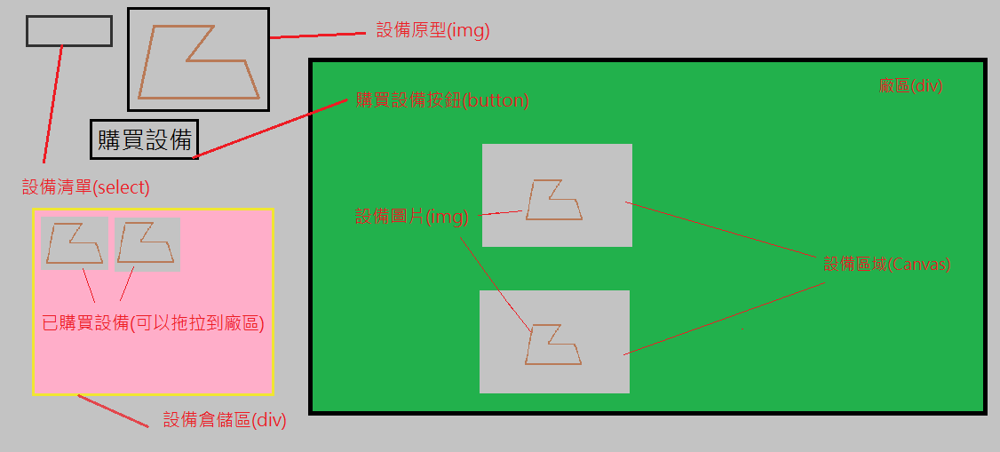

# 1.需求說明

[目前進度](./index.html)

## 概念示意圖的基本定義及想法

廠區(div), 裏頭會有許多的設備空間(canvas), 設備空間再畫上設備圖片(image)  
目前使用的方式, 是新增canvas, 再將裡面充填Image, 而非直接插入圖片(因為廠房產線上的設備未必直直地排好, 可能會有轉角度的問題, canvas操作這部分印象中較為容易.)  
Note. canvas本身是一個看不到的畫布, 使用canvas.getContext('2d')可以取得畫筆ctx, 再使用ctx.drawImage(), 來將圖片畫到畫布上面

---

## a. 前端
1. 模擬廠房平面圖, 上頭可以新增、拖拉、刪除機器設備的圖片(機器不可重疊)
2. 設備圖片大小的問題 , 目前是假設所有設備都是同樣大小的前提底下再做  (不合理)
    - 購置設備後, 可以拖拉設備大小   (第一次布置廠區時比較麻煩)
    - 原始圖片就事先裁切好設備的大小比例  (有點不切實際)
    - 其他

3. 可以將目前的擺設狀態儲存下來, 將來可再開啟, 這部分目前沒頭緒, 但應該可以參考旁邊的連結 [JavaScript APIs Current Status](https://www.w3.org/standards/techs/js#w3c_all)

## b. 後端
1. 每個機器設備的圖片點選後, 可以看到機器設備基本的狀態(與後端連結),ex: 設備id, 運轉燈號(紅黃綠), 連結網址(連到設備的完整資訊頁面), or 與Power BI串接
2. 網頁框架怎麼走? Severlet? Django? Flask? ...? ( so far prefer Python體系的網頁框架 )

## c. 未確定該放前端還後端
1. 機器設備圖片的新增
    - 直接寫死在html?  -> 不太可能這樣做
    - 圖片來自資料庫?  -> 後端
        - 衍生問題: 還得製作額外UI來讓使用者上傳設備圖片及設備基本屬性
    - 讓使用者可以自行由前端上傳, 之後再新增?  -> 前端  
        - [類似這樣, 可點選上傳鈕, Select再參考上傳後的清單](http://knuckles.disp.cc/github/imgUpload/imgUpload.html)
    - 讀取本地某資料夾底下的所有圖片, html內的下拉式選單可以動態新增  -> 前端

# 2.進度

## 應克服的問題
- 設備拖拉不應能重疊  目前會重疊 
- 新增設備應以下列其中一種方式來新增  目前的新增方式不怎麼合理 
    - 點選新增鈕後, 於廠區外新增設備, 再以拖拉的方式拖拉進廠區
    - 直接在場區double Click, 再點選的地方直接新增機器

## 將來可能產生的需求
- 可以批量新增設備(目前只能一台一台新增)
- 設備拖拉時, 顯示對齊線 [對齊線範例(但有瑕疵)](http://runjs.cn/code/7woaho1m)

--- 
Note on 2017/09/18, Tony